# TESTING

## Table of Contents

1. [Device Testing](#device-testing)
2. [Manual Testing](#manual-testing-of-user-stories)
3. [Lighthouse](#lighthouse)
4. [HTML Validator](#WC3-Validator)
5. [CSS Validator](#JIGSAW-Validator)

### Device testing

- Project was tested in various mobile devices and was running succesfully
- iPhone 13
    - Safari
- Samsung A34
    - Chrome
- HP Desktop
    - Chrome
    - Edge
    

Screenshots Home Page

  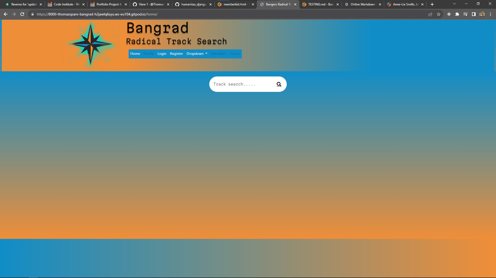
    
  

    - Not tested for Safari for laptop/ desktop
- Also tested various device sizes using [Dev.tools](https://developer.chrome.com/docs/devtools/)

### Manual testing of user stories

1. As a user I want to create a profile and upload a profile image, save social media links, and write my bio so that other users can learn more about me.

| **Step**                            | **Expected Result**                       | **Actual Result** |
| ----------------------------------- | ----------------------------------------- | ----------------- |
| Open website                        | home page loads                           | Work as expected  |
| User register at home page          | The sign up form is visible               | Work as expected  |
| User fills in the required fields   | If valid user is informed of success      | Works as expected |
| User login after register           | Success message and navmenu access        | Works as expected |

Screenshots of Create Profile

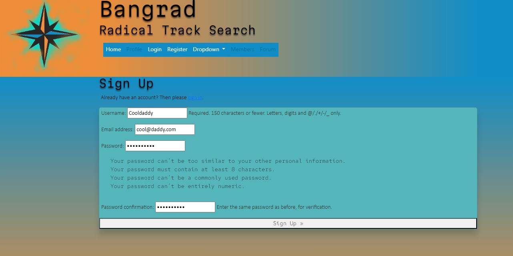
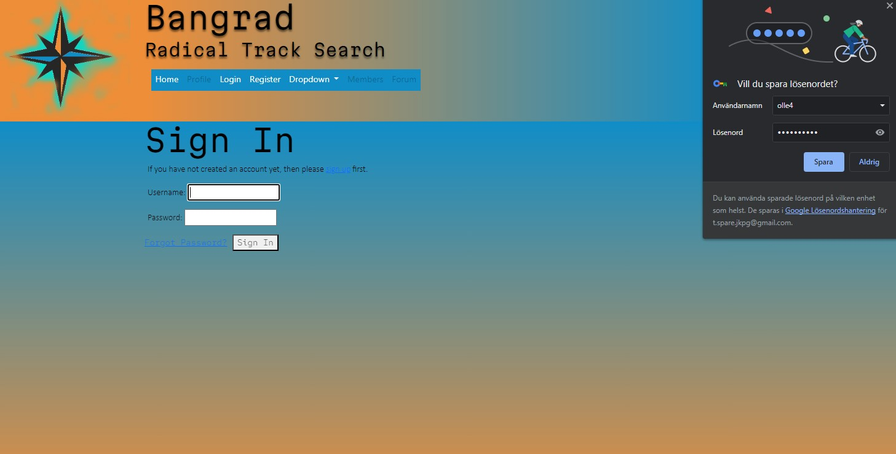
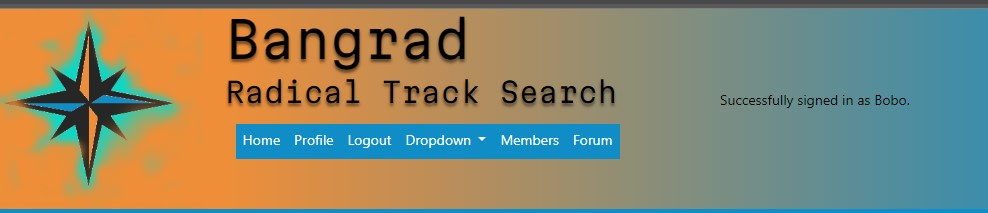

 
 

2. As a user I want to view and comment on other users forum posts so that I can learn about new music and connect with other users

| **Step**                                | **Expected Result**                     | **Actual Result** |
| --------------------------------------- | --------------------------------------- | ----------------- |
| Open website                            | home page loads                         | Work as expected  |
| User login                              | Navitem forum access                    | Work as expected  |
| User click on forum                     | user is taken to forum page             | Works as expected |
| User can scroll the forum               | forum posts in order of dateadded       | Work as expected  |
| User can make a post in the forum       | Form appear when create a post pushed   | Work as expected  |
| User can edit delete post               | Edit/ Delete only if user = author      | Work as expected  |
| User can edit posts                     | Users post appear with details          | Work as expected  |
| User can delete own post                | Delete form with confirmation           | Work as expected  |

 

Screenshots of Forum

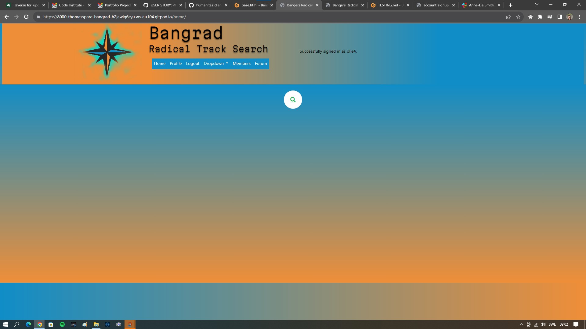
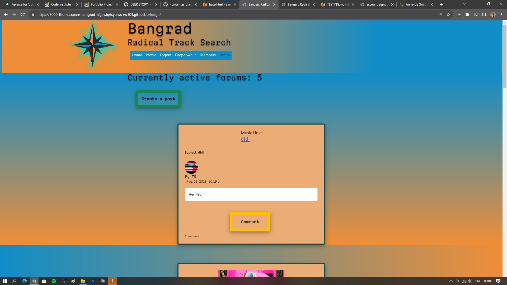
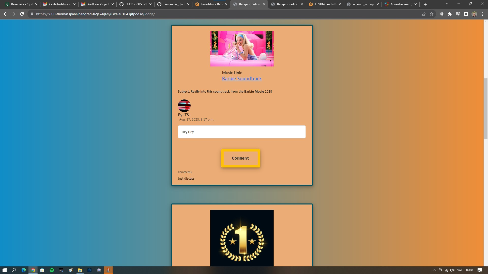

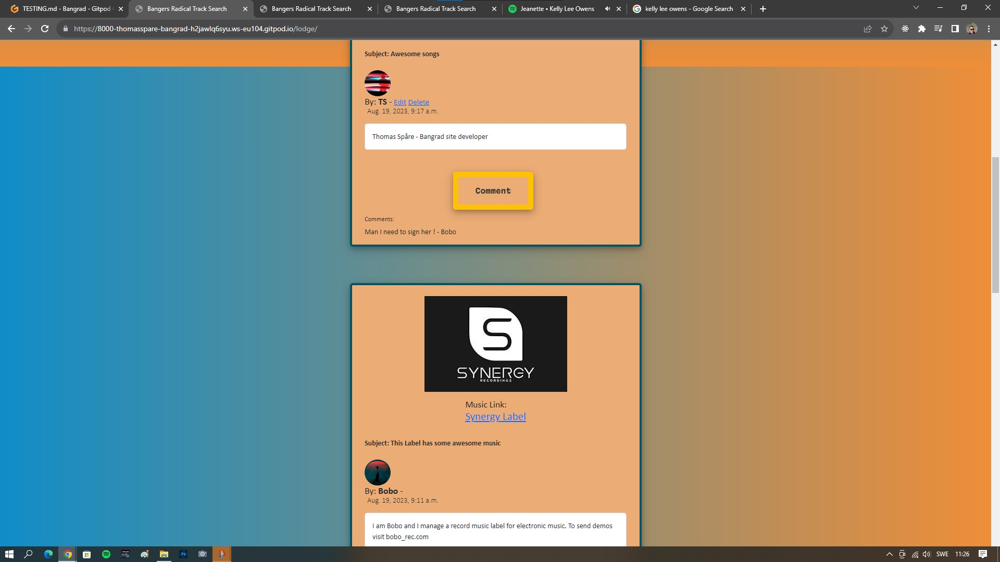
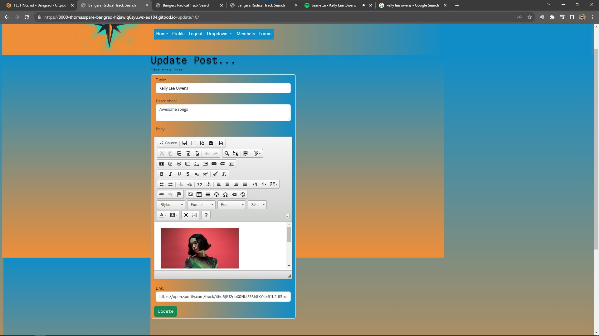
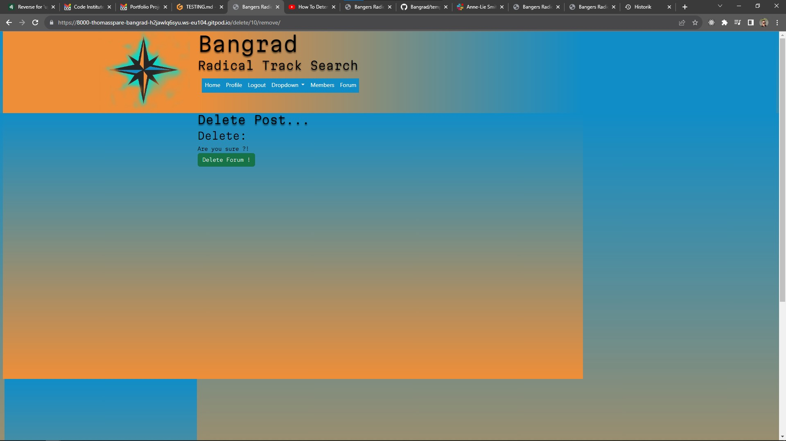

3. As a user I can share links, images, text, smileys in the forum so that other users can view, comment and them

| **Step**                                | **Expected Result**                     | **Actual Result** |
| --------------------------------------- | --------------------------------------- | ----------------- |
| Open website                            | home page loads                         | Work as expected  |
| User login                              | Navitem forum access                    | Work as expected  |
| User click on forum                     | user is taken to forum page             | Works as expected |
| User click on create post               | create post form appear                 | Work as expected  |
| User can style post with ckeditor       | Ckeditor available in form              | Work as expected  |
| User push submit                        | Create new post by the user as author   | Work as expected  |

Screenshot of Lighthouse TEST

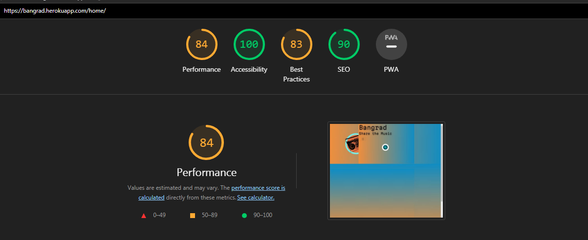

